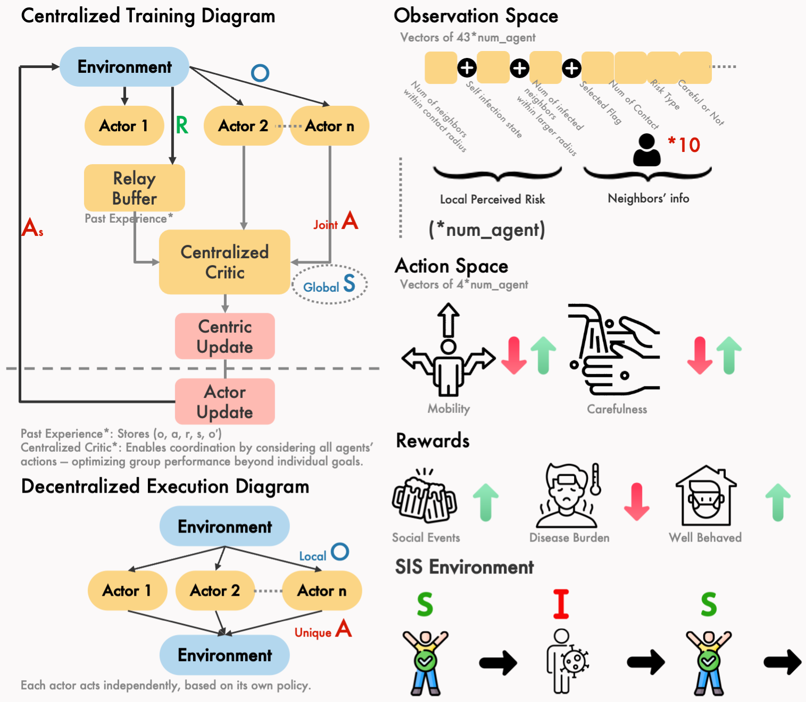
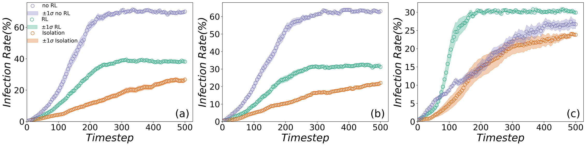

# Spatial Multi-Agent Reinforcement Learning for Epidemic Control with Heterogeneous Risk Preferences

**Te-Chun Liu and Hsuan-Wei Lee**  
Department of Information Management, National Taiwan University of Science and Technology, Taiwan  
College of Health, Lehigh University, USA  

This repository contains the spatial agent-based SIS environment and the multi-agent deep reinforcement learning (MADDPG) training scripts used to study epidemic control under heterogeneous risk preferences. The code implements decentralized policy learning on top of **agileRL 2.0.6** and **PettingZoo**, and reproduces the experiments and figures described in the manuscript.


*Figure: Overview of the spatial multi-agent RL environment and training pipeline.*

> **Note:** Trained checkpoints and large result spreadsheets are not included in this repository. Pretrained models can be downloaded from the link provided below or requested from the authors.


## Prerequisites (WSL2 + mini Conda)
First, set up WSL2 and a GPU-enabled PyTorch environment.

- WSL2 + GPU guide: [WSL2 GPU Setup](https://www.freecodecamp.org/news/how-to-setup-windows-machine-for-ml-dl-using-nvidia-graphics-card-cuda/)

- agileRL MADDPG tutorial (optional): [PettingZoo MADDPG tutorial](https://docs.agilerl.com/en/latest/tutorials/pettingzoo/maddpg.html)

We assume you are inside WSL2 and have `conda` available.

### Necessary Setup

Create the env like this:
```bash
conda env create -f environment.yml
conda activate epi
```

Project layout
- `custom-environment/`
    - notebooks for training and ablations (`Train.ipynb`, `Train_As.ipynb`, etc.)
    - inference scripts (`Inference.py`, `Inference_As.py`)
    - `env/` — custom PettingZoo-like environment (`env_v1.py`, *rewards*, *disease cost*, *infection rate* infos.)
    - `models/` — local trained MADDPG checkpoints (not pushed)
    - `result/` — spreadsheets for figures

- `environment.yml`— compatible conda env deps.

Before you run the code:
```bash
cd custom-environment # project root
```

---

## Inference a Pretrained model
Basic CLI:
```bash
python3 Inference.py
```
Optionally specify a checkpoint:
```bash
python3 Inference.py --ckptpath models/MADDPG/MADDPG_trained_agent.pt
```
Pretrained [weights](https://drive.google.com/drive/folders/19BLmB27GP_XQCgeG8sFiW96_cyWIhMwJ?usp=sharing):
```bash
gdown --id 1mKkZu0Qe1PMNrO0D0Ni_eV15M2cRdlXq -O models/MADDPG/MADDPG_trained_agent.pt
```
If the pretrained model is no longer available, contact the author.

## Train your own models
Open and run `Train.ipynb`. Adjust *max_steps* as needed.
- We recommend ≥ 30k steps to stabilize training.
- On an RTX 4070, ~11 minutes for 10k steps (your mileage may vary).
- Run `Train_As.ipynb` for representative learning / parameter-space grid search (details in paper).

## Reproducing Figures
The RL engine is written in agileRL 2.0.6 and the environment in PettingZoo.
To inspect environment variables (rewards, disease cost, infection rate, timestep), read:
`custom-environment/env/env_v1.py`

To reproduce the paper’s figures:


*Figure 1: Comparison of infection dynamics and policy outcomes across different agent risk types.*

- edit / run `Inference.py` or `Inference_As.py` (used for Fig. IV, Fig. V, etc.)
- or run the `Visualization.ipynb` using the data under `result/`

---
### Issues / future work
- Open an issue if you have questions.

- Please star the repo if you find it useful.

- Future: add Dockerfile, support for other multi-agent RL algorithms.

## Citation

If you use this code or framework in your research, please cite:

```bibtex
@article{liu2025spatialmarl,
  title   = {Spatial Multi-Agent Reinforcement Learning for Epidemic Control with Heterogeneous Risk Preferences},
  author  = {Liu, Te-Chun and Lee, Hsuan-Wei},
  journal = {Computers in Biology and Medicine},
  year    = {2025},
  note    = {Manuscript in preparation}
}
```

## License

**MIT License**

Copyright (c) 2025 Te-Chun Liu

Permission is hereby granted, free of charge, to any person obtaining a copy  
of this software and associated documentation files (the "Software"), to deal  
in the Software without restriction, including without limitation the rights  
to use, copy, modify, merge, publish, distribute, sublicense, and/or sell  
copies of the Software, and to permit persons to whom the Software is  
furnished to do so, subject to the following conditions:

The above copyright notice and this permission notice shall be included in all  
copies or substantial portions of the Software.

THE SOFTWARE IS PROVIDED "AS IS", WITHOUT WARRANTY OF ANY KIND, EXPRESS OR  
IMPLIED, INCLUDING BUT NOT LIMITED TO THE WARRANTIES OF MERCHANTABILITY,  
FITNESS FOR A PARTICULAR PURPOSE AND NONINFRINGEMENT. IN NO EVENT SHALL THE  
AUTHORS OR COPYRIGHT HOLDERS BE LIABLE FOR ANY CLAIM, DAMAGES OR OTHER  
LIABILITY, WHETHER IN AN ACTION OF CONTRACT, TORT OR OTHERWISE, ARISING FROM,  
OUT OF OR IN CONNECTION WITH THE SOFTWARE OR THE USE OR OTHER DEALINGS IN THE  
SOFTWARE.